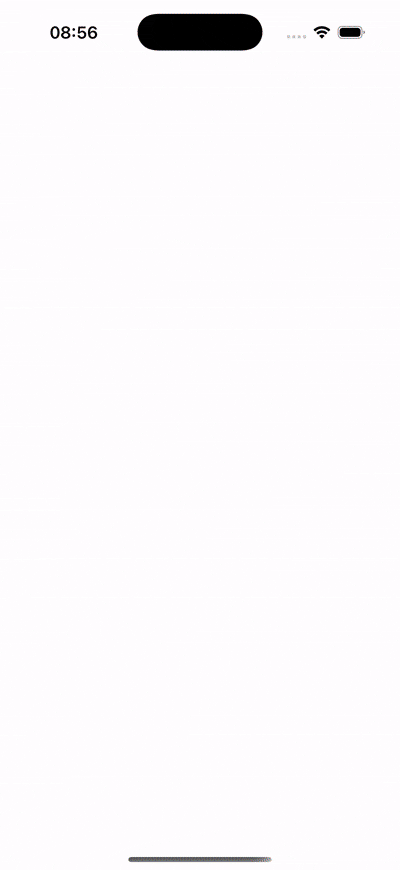

# ⭐️⭐️⭐️please star ⭐️⭐️⭐️
# LinearLayoutView
LinearLayout  tableHeaderView

The height of the tableHeaderView can be made to adapt very easily.
With a small amount of code, it achieves a great effect, and it can be used just like a LinearLayout.

```
    
    lazy var stackView = {
        LinearLayoutView(tableView: tableView)
    }()


    func testUI() {
        for i in 0...100 {
            let label = UILabel()
            label.text = "\(i)"
            label.backgroundColor = .random
            stackView.addArrangedSubview(label)
            if i == 10 {
                let v = UIView(frame: CGRect(x: 0, y: 0, width: 100, height: 200))
                stackView.addArrangedSubview(v)
                NSLayoutConstraint.activate([
                    v.heightAnchor.constraint(equalToConstant: 100)
                ])
            }
        }
        DispatchQueue.main.asyncAfter(deadline:.now() + 2) {
            let v = UIButton(type: .system)
            v.backgroundColor = .random
            self.stackView.addArrangedSubview(v)
            NSLayoutConstraint.activate([
                v.heightAnchor.constraint(equalToConstant: 500)
            ])
        }
    }

```

